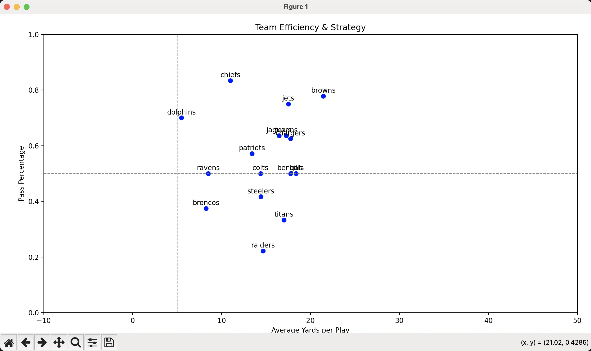

# buzzline-06-wilcox
In this custom streaming projecta Kafka producer generates JSON messages for consumption and based on that consumption a consumer then creates and inputes into a sqlite database and a second consumer then creates a visualization.

## Important Commands

#### Start Kafka in its own terminal
```bash
chmod +x scripts/prepare_kafka.sh
scripts/prepare_kafka.sh
cd ~/kafka
bin/kafka-server-start.sh config/kraft/server.properties
```

#### Create/activate virtual environment, upgrade pip, install requirement

```bash
python3 -m venv .venv
source .venv/bin/activate
python3 -m pip install --upgrade pip
python3 -m pip install --upgrade -r requirements.txt
```

#### Producer, Consumer, and Visualization functions
All functions must be run in separate terminals
```zsh
source .venv/bin/activate
python3 -m producers.producer_wilcox

source .venv/bin/activate
python3 -m consumers.consumer_wilcox

source .venv/bin/activate
python3 -m consumers.visualization_wilcox
```

## Producer information
1. Team on offense
2. Yards gained
3. Pass/run
4. Team on defense
5. Time

## Visualization description
The visualization that displays is a snapshot of efficiency where the x-axis is the average yards gained where and the y-axis is the pass percentage. The hope is to draw a correlation on average yards gained is higher based on pass percentage.


